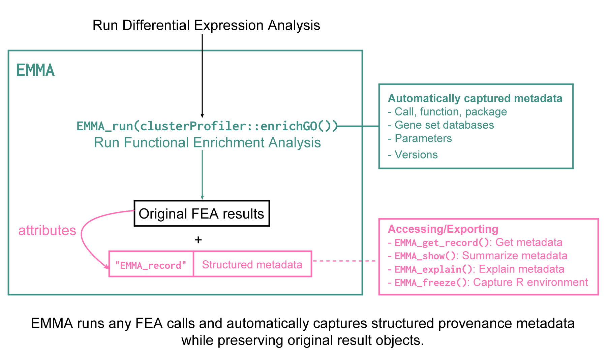

```{r knitr, include = FALSE}
knitr::opts_chunk$set(
  comment   = "#>",
  error     = FALSE,
  warning   = FALSE,
  eval      = TRUE,
  message   = FALSE
)
```

# Introduction {#introduction}

Functional Enrichment Analysis (FEA) is a key downstream step in omics workflows,
commonly applied after differential expression analysis to support biological
interpretation and generate pathway-level hypotheses. A wide range of tools and
methods are available, mainly Over-Representation Analysis (ORA) [@Khatri2012] 
and Gene Set Enrichment Analysis (GSEA) [@Subramanian2005], leading
to substantial heterogeneity in analytical choices and reported results.

Despite its widespread use, FEA is often insufficiently documented [@Wijesooriya2022].
Critical parameters such as background gene sets or multiple testing correction
methods are frequently missing or inconsistently reported in scientific papers,
limiting reproducibility and interpretability. Currently, no standardized framework
exists to ensure transparent and reproducible documentation of FEA workflows,
comparable to the MIAME guidelines [@Brazma2001].

To address this gap, we introduce `r BiocStyle::Biocpkg("EMMA")` (standing for 
**E**nrichment **M**ethods **MA**tters), a framework that automatically captures key 
analytical parameters and provenance information
during the execution of FEA methods.

This vignette demonstrates how `EMMA` integrates with existing tools
(e.g. `r BiocStyle::Biocpkg("clusterProfiler")`,
`r BiocStyle::Biocpkg("topGO")`, `r BiocStyle::Biocpkg("Enrichr")`, 
`r BiocStyle::Biocpkg("gprofiler2")`) to execute enrichment
analyses while systematically capturing analysis parameters and provenance
information during runtime, returning enrichment results
**without altering their original format**, alongside structured and reusable metadata. 

## What do you get with `EMMA`?

Using `EMMA` allows you to:

* Record the exact function call and parameters used for FEA
* Automatically track annotation sources (e.g. organism, gene set database)
* Retain provenance directly within the results object
* Generate reproducible summaries of the analysis (e.g. Methods sections)
* Facilitate sharing of results together with their analysis context

## How does `EMMA` work?

`EMMA` works by wrapping an enrichment call, executing it, and capturing relevant
provenance information and parameters during runtime. The recorded metadata is then
attached directly to the result object using R’s **attribute system**.

This approach enables `EMMA` to preserve provenance information
**without modifying the original result structure or introducing new classes**, 
allowing users to continue working seamlessly with standard outputs from existing tools.

While Bioconductor provides dedicated metadata slots for certain S4 classes
(e.g. via `metadata()`), these are not consistently available across all enrichment
result types. By relying on attributes, provenance information can be attached
to any result object regardless of its underlying class.



# Getting started {#gettingstarted}

To install this package, start R and enter:

```{r install, eval = FALSE}
if (!requireNamespace("BiocManager", quietly = TRUE)) {
  install.packages("BiocManager")}

BiocManager::install("EMMA")
```

Once installed, the package can be loaded and attached to the current workspace
as follows:

```{r setup}
library("EMMA")
```

# Usage example of `EMMA`: the `macrophage` dataset

## About the data

In the remainder of this vignette, we will illustrate the main features of `r BiocStyle::Biocpkg("EMMA")` on a publicly available dataset from
Alasoo, et al. "Shared genetic effects on chromatin and gene expression
indicate a role for enhancer priming in immune response", 
published in Nature Genetics, January 2018 
[@Alasoo2018].

The data is made available via the `r BiocStyle::Biocpkg("macrophage")`
Bioconductor package, which contains the files output from the Salmon
quantification (version 0.12.0, with GENCODE v29 reference), as well as the
values summarized at the gene level, which we will use to exemplify.

In the `macrophage` experimental setting, the samples are available from 6
different donors, in 4 different conditions (naive, treated with Interferon
gamma, with SL1344, or with a combination of Interferon gamma and SL1344).

Let's start by loading all the necessary packages:

```{r loadlibraries}
library("EMMA")

library("macrophage")
library("DESeq2")
library("org.Hs.eg.db")
library("clusterProfiler")
library("mosdef")
library("topGO")
library("GO.db")
```

We will show an example of how  `r BiocStyle::Biocpkg("EMMA")` fits into a
regular bulk RNA-seq data analysis workflow.

## Getting a list of Differentially Expressed Genes

For this, we will load the `macrophage` data and perform Differential Expression
Analysis with `r BiocStyle::Biocpkg("DESeq2")`

```{r differential_expression}
# load data
data(gse, "macrophage")
# set up design
dds_macrophage <- DESeqDataSet(gse, design = ~ line + condition)
# preprocess
rownames(dds_macrophage) <- substr(rownames(dds_macrophage), 1, 15)
keep <- rowSums(counts(dds_macrophage) >= 10) >= 6

dds_macrophage <- dds_macrophage[keep, ]

# run DESeq
dds_macrophage <- DESeq(dds_macrophage)

# get de res for 1st contrast
IFNg_vs_naive <- results(dds_macrophage,
                         contrast = c("condition", "IFNg", "naive"),
                         lfcThreshold = 1, alpha = 0.05)
IFNg_vs_naive <- lfcShrink(dds_macrophage, coef = "condition_IFNg_vs_naive",
                           res = IFNg_vs_naive,
                           type = "apeglm")
IFNg_vs_naive$SYMBOL <- rowData(dds_macrophage)$SYMBOL

# sort by adjusted p value
de_res <- IFNg_vs_naive[order(IFNg_vs_naive$padj), ]
de_res <- de_res[!(is.na(de_res$padj)) & de_res$padj <= 0.05, ]

# set background gene list
gene_universe <- rownames(dds_macrophage)
```

## Performing Functional Enrichment Analysis (FEA) 

Now that we have a list of DE genes for this contrast, we can perform Functional
Enrichment Analysis.  
We do this first *without* the functionality provided by `EMMA`.

In the following example, we will use the
function `enrichGO()` from `r BiocStyle::Biocpkg("clusterProfiler")`

```{r withoutemma}
fea_res <- enrichGO(gene = rownames(de_res),
                    universe = gene_universe,
                    keyType = "ENSEMBL",
                    OrgDb = org.Hs.eg.db,
                    ont = "BP",
                    pAdjustMethod = "BH",
                    pvalueCutoff = 0.05,
                    qvalueCutoff = 0.1)
```

# Entering the `EMMA` framework

From now on, we will complement the existing workflow with the functionality 
provided by `EMMA`.


## `EMMA_run()`: Capturing the recorded information

`EMMA_run()` accepts a function call (e.g. `enrichGO(...)`) and executes it as
it is, while capturing the associated parameters and provenance information:

```{r EMMA_run_1}
# perform FEA, but with EMMA!
fea_res <- enrichGO(gene = rownames(de_res),
                    universe = gene_universe,
                    keyType = "ENSEMBL",
                    OrgDb = org.Hs.eg.db,
                    ont = "BP",
                    pAdjustMethod = "BH",
                    pvalueCutoff = 0.05,
                    qvalueCutoff = 0.1) |> 
  EMMA_run() # simply pipe your call to EMMA_run()
# check res
fea_res
```

... or you can simply wrap `EMMA_run()` around your call:

```{r EMMA_run_2}
# you can also pass the function name and its namespace
# e.g. `clusterProfiler::enrichGO(...)`
fea_res_nobg <- EMMA_run(
  clusterProfiler::enrichGO(
    # no universe set
    gene = rownames(de_res),
    keyType = "ENSEMBL",
    OrgDb = org.Hs.eg.db,
    ont = "BP",
    pAdjustMethod = "BH",
    pvalueCutoff = 0.05,
    qvalueCutoff = 0.1,
    readable = TRUE
  )
)
```

As you can see, `EMMA` returns the FEA results in their **native/standard** format.
`EMMA` also warns you about good practices when performing FEA, like in this
example, we didn't define a list of background genes (which can influence the 
results leading e.g. to a larger amount of false discoveries, as a consequence 
of over-optimistic smaller p-values [@Wijesooriya2022]), so we get warned about that.

## `EMMA_show()`: Summarizing the recorded information

To get a quick summary of what `EMMA` captured while we ran the analysis, we use
`EMMA_show()`:

```{r EMMA_show}
EMMA_show(fea_res)
```

`EMMA` attaches the captured metadata to the attributes of the
results object. That's why it is always a good practice to save the original
results, and not only the subsets of interest.

## `EMMA_get_record()`: Retrieving the recorded information

To access the full recorded information, we use `EMMA_get_record()`:

```{css}
/*| echo: false */

.scrollout {
max-height: 500px;
overflow-y: scroll;
}
```

```{r EMMA_get_record}
#| class-output: scrollout

emma_record <- EMMA_get_record(fea_res)

# get all the record
emma_record
```

`EMMA` structures the `EMMA_record` attribute (i.e. the recorded provenance
information) into a list of elements:

```{bash EMMA_record_str, eval=FALSE}
├── EMMA_record
│   ├── method         # how the analysis was performed
│   │   ├── call
│   │   ├── function_name
│   │   ├── package_name
│   │   ├── package_version
│   │   ├── wrapped_function
│   │   ├── wrapped_package
│   │   └── wrapper
│   ├── input         # inputs used for the analysis
│   │   └── arguments
│   ├── annotation    # annotation context
│   │   ├── organism
│   │   ├── gene_set_db
│   │   └── gene_set_db_version
│   ├── timestamp     # when the analysis was run
│   ├── session_info  # R session information
│   ├── extra         # user-defined additions
│   └── emma_version
```

```{r EMMA_method}
# get the method record
emma_record$method
```

With `EMMA_run()`, we can decide whether we want to save the value of arguments
used in our call or not. This can be useful, for example, to avoid unnecessarily
increasing the size of the result object. For this, we can use the argument `args_form`:

```{r argument_form}
#| class-output: scrollout

fea_res_no_param <- enrichGO(gene = rownames(de_res),
                             universe = gene_universe,
                             keyType = "ENSEMBL",
                             OrgDb = org.Hs.eg.db,
                             ont = "BP",
                             pAdjustMethod = "BH",
                             pvalueCutoff = 0.05,
                             qvalueCutoff = 0.1,
                             readable = TRUE) |> 
  EMMA_run(args_form = "unevaluated") # when we don't want the values stored
                                      # else set to evaluated (default)

# check
EMMA_get_record(fea_res_no_param)
```

We can also choose whether to save the R session information with the record
using the argument `store_session_info`, which defaults to `TRUE`.

## `EMMA_explain()`: Summarizing recorded information into text

`EMMA_explain()` generates a human-readable description of the FEA, similar
to a Materials and Methods section of a paper, by summarizing the executed call,
the parameters, software context, and reference databases used.

```{r EMMA_explain, results = 'asis', message=TRUE}
EMMA_explain(fea_res, get_citation = TRUE)
```

## `EMMA` with custom/wrapper functions

You can also use a custom function that you developed, or a wrapper function
(from packages such as `r BiocStyle::Biocpkg("mosdef")`). In this case,
`EMMA_run()` will attempt to capture as much metadata as possible:

```{r mosdef_eg}
#| class-output: scrollout

mosdef_fea_res <- mosdef::run_goseq(de_genes = rownames(de_res),
                                    bg_genes = gene_universe,
                                    mapping = "org.Hs.eg.db",
                                    id = "ensGene",
                                    genome = "hg19") |> 
  EMMA_run(store_session_info = FALSE,
           args_form = "unevaluated")

# quick inspection
EMMA_get_record(mosdef_fea_res)
```

```{r custom_eg}
#| class-output: scrollout

# a custom function (not from a package)
my_custom_function <- function(gene, universe = NULL,
                               ontology = "BP", id_type = "ENTREZID",
                               org_db_name = "org.Hs.eg.db", 
                               organism = "hsapiens") {
  res1 <- mosdef::run_topGO(de_genes = gene,
                            bg_genes = gene_universe,
                            ontology = ontology,
                            gene_id = id_type,
                            mapping = org_db_name,
                            add_gene_to_terms = TRUE)

  res2 <- gprofiler2::gost(query = gene,
                           organism = organism,
                           custom_bg = gene_universe)

  return(list(topGO_res = res1,
              gost_res = res2
  ))
}

# run analysis with EMMA
frankenstein_fea <- my_custom_function(
  gene = rownames(de_res),
  universe = gene_universe,
  ontology = "BP",
  id_type = "ENSEMBL",
  org_db_name = "org.Hs.eg.db",
  organism = "hsapiens"
  ) |> EMMA_run(store_session_info = FALSE,
                args_form = "unevaluated") 

# quick inspection
EMMA_get_record(frankenstein_fea)
```

## `EMMA_add_custom_metadata()`: Adding extra information

The user can always attach extra metadata that `EMMA` might not be able to
capture automatically. To keep everything organized, we can use
`EMMA_add_custom_metadata()` function

```{r add_custom_metadata}
#| class-output: scrollout

frankenstein_fea2 <- EMMA_add_custom_metadata(res = frankenstein_fea,
                                              extra = list(
                                                wrapped_function_topGO = "runTest",
                                                notes = "any other meaningful info"))

EMMA_get_record(frankenstein_fea2)$extra
```

Since the `EMMA_record` is attached as attribute to the original results objects,
it can be preserved when integrating results into structured containers
such as `r BiocStyle::Biocpkg("DeeDeeExperiment")` [@Abassi2026].
This enables both FEA results and their associated provenance information
to be stored and managed together, facilitating reproducibility, organization,
and sharing of complex omics analyses.

```{r emma_and_dde}
#| class-output: scrollout

dde <- DeeDeeExperiment::DeeDeeExperiment(sce = dds_macrophage,
                                          de_results = IFNg_vs_naive,
                                          enrich_results =  list(
                                            IFNg_vs_naive = fea_res_no_param)
                                          )

fea <- DeeDeeExperiment::getFEA(dde, format = "original")

EMMA_get_record(fea)
```

## `EMMA_freeze()`: Recording the Analysis Environment

`EMMA_freeze()` records the R environment at the time of analysis by generating
a lockfile using `renv`. By default, the snapshot is created with `force = TRUE`,
allowing the environment to be recorded even when inconsistencies (e.g. version
mismatches) are present.

This behavior reflects the goal of preserving the analysis environment as it was
used in practice, rather than attempting to enforce a fully consistent state.

```{r EMMA_freeze}
if (requireNamespace("renv", quietly = TRUE)) {
  project_path <- tempfile("my_project_with_emma")
  dir.create(project_path)
  EMMA_freeze(project = project_path,
              file = "analysis.lock",
              pkgs = loadedNamespaces(),
              prompt = FALSE,
              force = TRUE)
}
```

# Session info {.unnumbered}

```{css}
/*| echo: false */

.smaller {
  font-size: 10px
}
```

```{r sessioinfo}
#| class-output: smaller

sessionInfo()
```

# References {.unnumbered}
